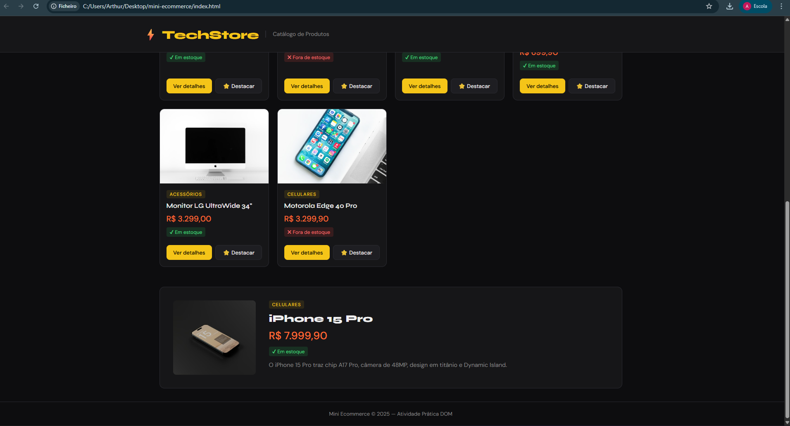
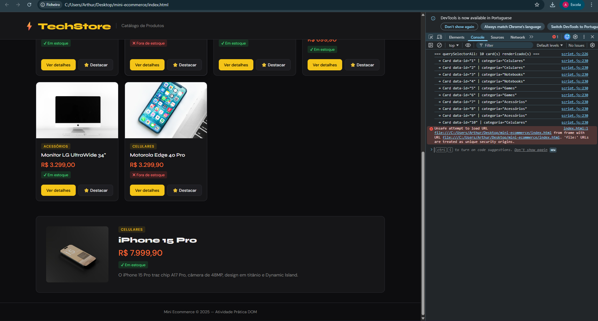

# Mini Ecommerce — Catálogo em Cards

> Atividade Prática: Funções e Manipulação do DOM com JavaScript

## 👤 Identificação

| **Nome** | Arthur Moreira
| **Matrícula** | 909477 |

##  Prints

> **Substitua as seções abaixo com seus próprios prints após rodar o projeto.**

### Cards renderizados

### Área de detalhes preenchida

### Console do navegador — querySelectorAll

---

